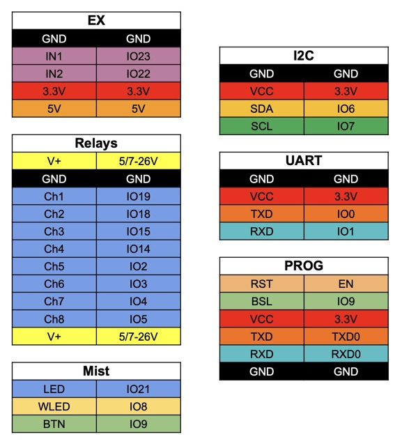



An adapter board based on **ESP32-C6** for upgrading ready-made relay modules in the popular “Arduino relay board” form factor.

It supports both classic electromechanical relay boards and solid-state relay boards, typically with **2 / 4 / 8 channels**.

The idea is simple: replace the stock controller with a compact C6 board, and your old relay module gets modern wireless connectivity: **Wi‑Fi 6, BLE 5, Zigbee / Thread (802.15.4)**.

## Overview

What this board provides:

- compatibility with common off-the-shelf relay modules;
- clean installation without messy point-to-point wiring;
- easy firmware flashing and integration with Home Assistant / MQTT;
- selectable relay supply rail (5V or 7–26V);
- one hardware platform for 2, 4, and 8 channel variants.

## Board




## Installation examples (relay modules)









## Compatibility

The board targets common “Arduino relay board” style modules with logic control inputs for each channel.

Compatible with:

- 2CH relay modules;
- 4CH relay modules;
- 8CH relay modules;
- 4CH solid-state relay modules (SSR)
- 8CH solid-state relay modules (SSR)


Before installation, verify the relay voltage and use the corresponding power supply and jumper position on the C6 board.


## Power

Input supply can be selected by jumper:

- **5V** mode;
- **7–26V** mode.

The same selected voltage rail is used to power the relay board itself, so the adapter supports relay modules powered by:

- **5V**;
- **12V**;
- **24V**.

Power input options:

- **5.5 × 2.1 mm DC jack** (common barrel connector);
- **1×2P 3.5 mm terminal block** with removable plug.

## I/O and expansion connectors

The board includes one **1×5P 3.5 mm** connector with removable plug.

It can be configured for:

- two digital inputs with galvanic isolation;
- or direct connection of those inputs to ESP32 (selectable by jumper).

The same connector also provides auxiliary power pins:

- **+3.3V** up to **100 mA**;
- **+5V** up to **100 mA** (available only when input supply is **7–26V**);
- **GND**.

Additionally, there are two **1×4P 2.54 mm** headers:

1. I2C header for sensors or expansion boards;
2. UART header for sensors or expansion boards.

## Pinout

## Firmware and integration

The board can be used with Arduino, ESP-IDF, ESPHome, and Tasmota.

Programming/flashing is possible both via **USB Type-C** and via a standard **ESP32 USB-to-TTL adapter** using the **1×6P 1.27 mm PROG connector**.

For connectivity/integration, the ESP32-C6 platform supports:

- Wi‑Fi 6 (2.4 GHz);
- Bluetooth LE 5.x;
- Zigbee / Thread (802.15.4).

This allows building not only Wi‑Fi + MQTT devices, but also **Zigbee** and **Bluetooth** based solutions (depending on selected firmware stack).

### Templates (spoiler)









## Where to use

- smart home lighting and load control;
- automation cabinets and relay control blocks;
- modernizing old relay projects without full hardware redesign.

## Where to buy

The board is **not on sale yet**.

I am currently collecting pre-orders to understand demand.
If you are interested, please contact me using any convenient method.
